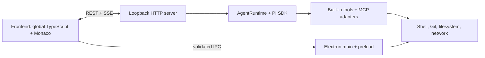
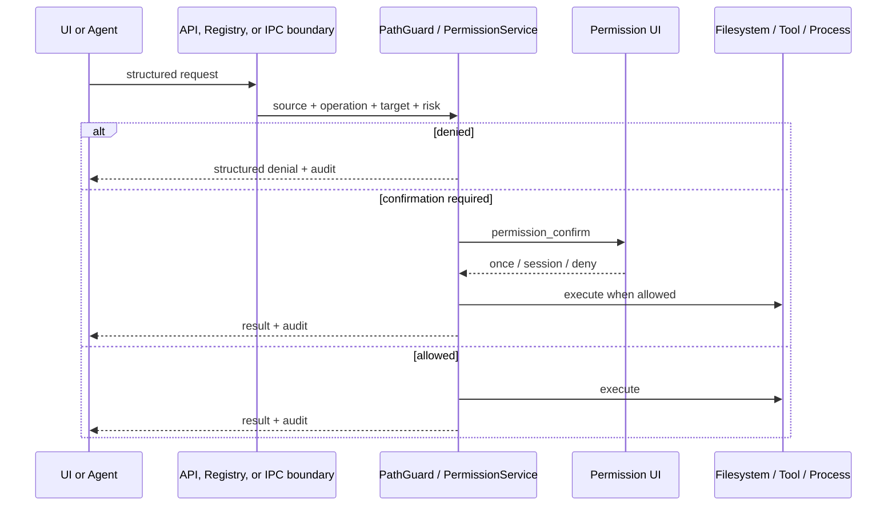

# Architecture

my-code-agent is a desktop-first local code agent built around the PI SDK. The
CLI is a secondary host over the same Agent runtime.



## Runtime Boundaries

### Frontend

`src/frontend` contains the desktop UI, Monaco integration, panes, and global
application services. TypeScript sources are compiled by
`scripts/compile-frontend-ts.mjs`; `src/frontend/gen` is generated output and
must not be edited by hand.

`UiStateStore` owns persisted workspace UI state. `App.State` is the public
facade for the active workspace path and retains the legacy `workspace_path`
key only as startup compatibility state. Business modules must not read or
write that key directly. `TabStore` is the target owner for tab state, although
legacy `window.__state` projections still exist during migration.

### Server

`src/server/server.ts` creates the Agent runtime, security services, HTTP
server, and SSE channels. Route handlers receive a shared `ServerContext`.

Before route dispatch, the server:

1. installs response security headers and CORS stripping;
2. validates origin, fetch-site, and desktop token requirements;
3. dispatches to a route handler only after the request passes the local API
   boundary.

The Electron main process owns the per-run desktop token. The preload requests
it over sender-validated IPC, and the trusted renderer supplies it once to
`/api/bootstrap`. The server only creates the HttpOnly session cookie after a
valid token is presented; public bootstrap responses do not disclose it.

Filesystem routes call `authorizeRoutePath()`, which combines PathGuard and
`ServerPermissionService`. Domain-specific helpers are used for internal
configuration and session persistence.

### Agent Runtime

`src/agent/runtime.ts` owns PI session lifecycle and injects host-controlled
context into custom tools. The model cannot set `permissionMode`, shell
dialect, confirmation callbacks, permission state, or desktop API token.

`ToolRegistry.toPITools()` and the asynchronous adapter both call the shared
tool authorizer. Direct file tools additionally call the shared path authorizer
with an operation and source label.

### Command Security

The command tool uses layered checks:

1. hard danger detection that cannot be bypassed by permission mode;
2. read-only validation when the caller requires read-only behavior;
3. shell parsing and path-operation extraction;
4. session permission evaluation and user confirmation;
5. process creation using the host-selected shell dialect.

POSIX Bash uses the Tree-sitter path where available. Ambiguous or unsupported
syntax fails closed. `MY_CODE_AGENT_TREE_SITTER_SHADOW=1` enables verdict
comparison against the legacy parser without changing the execution verdict.

### MCP

MCP configuration can come from project or application config. Config reads
and writes pass through governed filesystem paths. A server trust decision is
required before use, and each adapted MCP tool execution passes through the
shared tool permission gate.

### Electron

`src/electron/electron-main.ts` starts or connects to the loopback server,
creates sandboxed windows, and restricts navigation. `preload.ts` exposes a
small API. `desktop-ipc.ts` owns the IPC channel allowlist, schema checks, and
trusted-root checks for reveal/trash operations. Token bootstrap requests are
accepted only from the active application window at an allowed app URL.

## Privileged Request Flow



## State And Persistence

- Session JSONL, blocks, traces, and headers live under the configured session
  directory and use synchronous or asynchronous permission authorization.
- UI state and permission audit history live under the application config
  directory and use explicit source labels.
- Session permission rules are process-local today. Persistent workspace/local
  rule storage is a planned extension, not an existing guarantee.

## Extension Rules

When adding a tool, route, or IPC operation:

- declare its operation, risk, permission requirement, and workspace scope;
- resolve and authorize every local path before I/O;
- return structured denial information;
- add a regression test for the privileged boundary;
- update `SECURITY.md` when the threat model or public API surface changes;
- update `docs/governance-plan.md` when an acceptance item changes state.

## Verification Gates

The normal gates are:

```text
npm run typecheck
npm test
npm run build
```

Focused security suites are useful during development but do not replace the
full release gate or packaged desktop E2E.
